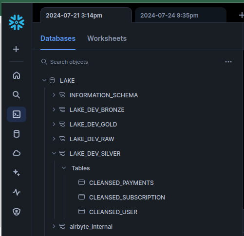
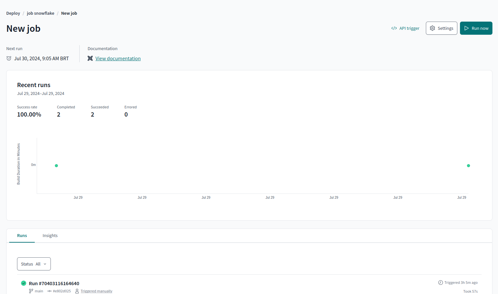

# Modern Data Stack Architecture

## Descrição do Projeto
Este projeto implementa uma arquitetura de Modern Data Stack para ingestão, processamento e análise de dados provenientes de diversas fontes. Utilizamos uma combinação de Airbyte, dbt Cloud, Apache Airflow, Snowflake e Metabase para criar um pipeline de dados eficiente e escalável.

## Visão Geral da Arquitetura

## Componentes Utilizados

### 1. Ingestão de Dados
**Airbyte Cloud**: Utilizado para extrair dados de fontes como MySQL e MongoDB e inseri-los no nosso Data Lake.

### 2. Processamento de Dados
**dbt Cloud**: Responsável por transformar os dados em várias camadas no Snowflake:

- **Raw Layer (Schema: lake_dev_raw)**: Dados brutos inseridos diretamente pelas ferramentas de ingestão.
- **Bronze Layer (Schema: lake_dev_bronze)**: Dados brutos selecionados e materializados como tabelas.
- **Silver Layer (Schema: lake_dev_silver)**: Dados limpos, onde realizamos a limpeza de campos e transformações como a criação de colunas a partir de colunas JSON.
- **Gold Layer (Schema: lake_dev_gold)**: Dados finais prontos para consumo, com junções e agregações realizadas para análises de negócios.

### 3. Data Warehouse
**Snowflake**: Utilizado como nosso Data Warehouse, onde armazenamos os dados processados nas diferentes camadas (Raw, Bronze, Silver, Gold). O Snowflake fornece uma plataforma escalável e de alto desempenho para armazenamento e consulta de dados.

### 4. Orquestração
**Job Dbt Cloud **: Job dbt cloud

### 5. Análise de Dados
**Metabase**: Ferramenta open source de análise de dados utilizada para consumir e visualizar os dados da camada Gold.

## Estrutura do Projeto

### 1. Airbyte
Configuração dos conectores para MySQL e MongoDB, e ingestão dos dados para o Snowflake no schema `lake_dev_raw`.

### 2. dbt Cloud
Scripts de transformação para processar os dados das camadas Raw, Bronze, Silver e Gold no Snowflake.

### 3. Apache Airflow
DAGs configuradas para orquestrar as tarefas de ingestão e transformação dos dados.

### 4. Metabase
Dashboard e relatórios configurados para visualizar os dados da camada Gold no Snowflake.

## Como Executar o Projeto

### Pré-requisitos
- Docker
- docker-compose
- Airbyte Cloud
- dbt Core
- Apache Airflow
- Metabase
- Snowflake

### Passo a Passo

1. **Configurar Airbyte**:
   - Configure as conexões para MySQL e MongoDB no Airbyte Cloud.
   - Defina os destinos para o Snowflake no schema `lake_dev_raw`.

2. **Transformações com dbt**:
   - Clone o repositório do dbt e configure suas conexões com o Snowflake.
   - Execute os scripts dbt para processar os dados nas camadas Bronze, Silver e Gold no Snowflake.

4. **Análise com Metabase**:
   - Suba o container do Metabase:
     docker run -d -p 3000:3000 --name metabase metabase/metabase

   - Configure o Metabase para conectar ao Snowflake e crie os dashboards necessários.

## Resultado da arquitetura com os dados da gold sendo consumidos pelo metabase

